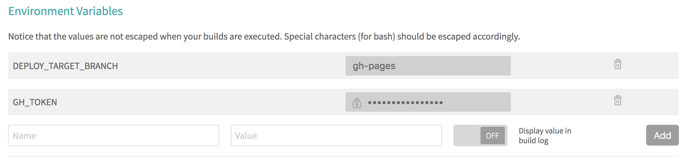

# Dataviz finances Gironde [](https://travis-ci.org/datalocale/dataviz-finances-gironde)

## Contribuer

Au vu du scope du projet et de sa spécificité franco-française, il est décidé que le *readme*, les *issues*, *pull requests* et messages de *commit* sont à écrire **en français**.

Le code et les commentaires sont à écrire **en anglais**.

## Compatibilité navigateur

Minima:

* IE11
* Edge
* Firefox
* Chrome
* navigateurs mobiles


## Installer le projet

L'installation de [`node@>=6`][nodejs] est nécessaire avant de continuer.

Il faut (_forker_ et) _cloner_ ce dépôt pour procéder à l'installation des dépendances du projet :

```bash
npm install
```

## Développer

La commande suivante reconstruit les builds en continu, dès qu'un fichier source est modifié :

```bash
npm run watch
```

Enfin, les composants web sont visualisables dans un navigateur web :

```bash
npm start
```

Deux adresses sont ensuite accessibles : [http://localhost:3000/]() et [http://localhost:3000/public/]().

## Intégration continue

L'intégration continue automatise les éléments suivants :

* exécution des tests sur _chaque branche_ ;
* déploiement de la [démo][] depuis _master_ ;

Le suivi des _builds_ est assuré par [Travis CI][].

### Installation

En se rendant sur [Travis CI][] :

1. se connecter avec son compte GitHub (_Sign in with Github_) ;
2. se rendre sur son [profil Travis CI][] ;
3. cocher la case du projet `datalocale/dataviz-finances-gironde`.

Reste ensuite à [configurer l'outil](#configurer-travis-ci).

### Configurer Travis CI

Deux variables d'environnement doivent être configurées dans l'[onglet Settings][ci-settings] :

| Name | Value | Display value in build logs |
| --- | --- | --- |
| `GH_TOKEN` | _voir [Générer un token](#générer-un-token)_ | ⚠️ **Off** ⚠️ |
| `DEPLOY_TARGET_BRANCH` | gh-pages | _On_ |



### Générer un token

Un _Personal access token_ est nécessaire pour que l'automate d'intégration continue puisse publier la [démo][].

🔓 [Générer un nouveau _token_](https://github.com/settings/tokens/new?description=datalocale.github.io/dataviz-finances-gironde&scopes=public_repo)

Le token créé est à renseigner dans la [configuration Travis CI](#configurer-travis-ci).

## Déploiement

### Pré-production et Production

Il faut créer manuellement un "media dataviz" dans le CMS gironde.fr.
Il faut également créer un contenu de type "Code HTML5" où il faut coller le contenu du fichier `gironde-fr-integration.html`. Le fichier JavaScript `dataviz-finance-gironde-fr-bundle.script` est à ajouter indépendamment.

Ces fichiers sont contenus dans les `zip` suivants :

| | Pré-production | Production |
| --- | --- | --- |
| Media ID | `1938`  | `2459`  |
| [Release][releases] | `preprod.zip`  | `production.zip`  |

Ces archives sont automatiquement rendus disponibles dans l'[onglet GitHub Releases][releases].

Ces artéfacts peuvent néanmoins être générés manuellement avec ces commandes (cf. [Installer le projet](#installer-le-projet)) :

* `npm run build-preprod`
* `npm run build-production`

Les artéfacts nouvellement créés sont disponibles dans le répertoire `./build` du projet.

### Démo

La [démo][] est déployée automatiquement.

Ses artéfacts peuvent néanmoins être générés manuellement avec la commande (cf. [Installer le projet](#installer-le-projet)): `npm run build-demo:public`.

Les artéfacts nouvellement créés sont disponibles dans le répertoire `./build` du projet.

### Convertir l'image de fond de la page d'accueil

Cette action requiert [ImageMagick][] et est à effectuer à chaque fois que l'image `images/Map-v1.jpg` est mise à jour.

```bash
$ convert images/Map-v1.jpg -interlace Plane -resize 1300 -strip images/map-optimised.jpg
```

## Licence

[MIT](LICENSE)

[nodejs]: https://nodejs.org/
[ImageMagick]: https://www.imagemagick.org/script/download.php
[Travis CI]: https://travis-ci.org/datalocale/dataviz-finances-gironde
[profil Travis CI]: https://travis-ci.org/profile
[démo]: https://datalocale.github.io/dataviz-finances-gironde/public/
[ci-settings]: https://travis-ci.org/datalocale/dataviz-finances-gironde/settings
